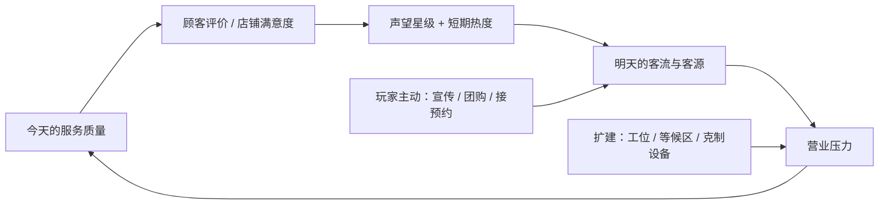

# 基建完成后的扩展机关玩法提案（v2）

**状态：方向已由产品负责人拍板（见第 11 节），暂不实现。开始任何切片前需要产品负责人再次明确指令；在此之前不修改代码、场景、配置、存档或正式资产。**

日期：2026-09-30。本版替代上一版只围绕“网红探店”的提案。产品负责人补充：网红探店只是一个例子；要参照《胡闹厨房》“每关一个新机关”多想玩法；这些机关必须在店铺基础建设差不多完成后才开启；机关要有阻碍（例如服务差导致网红发差评、店铺客流变差）；玩家也可以主动投入宣传经费拉客，但可能因此顾客过多、服务不周。

## 1. 设计原则

1. **基建先行。** 前几天只学服务、补货和扩建；基础建设完成后才进入“机关期”。
2. **一次只加一个新机关。** 照《胡闹厨房》的节奏：第一次出现时是安全的教学版本，之后单独练一两天，再和旧机关组合。
3. **每个机关都是双刃剑。** 必须同时有收益、阻碍和玩家对策；只有惩罚、没有选择的事件不做。
4. **玩家可以自己决定今天多难。** 宣传、团购、接预约都是主动加码：赌自己接得住，换更多收入和口碑。
5. **能预判，能补救，不形成死亡螺旋。** 所有负面影响都会提前预告、限时结束，并至少有一个补救办法。
6. **不改已批准的地图。** 机关是叠在现有布局上的临时物件或状态（一堆碎发、一个电闸箱、一只猫），不重排房间。新物件照规定先走 Manifest。
7. **手机单指能操作。** 只用“走过去 + 自动处理或按一下现有操作键”，不增加新手势。
8. **不新增货币和页面。** 花费都用现有营业余额；选择在场景里完成（走进施工圈或告示板光圈），沿用已确认的“空间触发式扣费”。

## 2. 现在的事实：为什么后期会枯燥，为什么必须等基建

- **基建花完后，金币就没去处了。** 现在只有三项扩建：第二张理发椅 180、补货架 180、自动吹风支架 1200。两日实测里第 2 天结束余额已有 1814，熟练玩家大约第 3 天就能全部买完，之后赚钱不再改变什么。
- **每天完成 5–6 单，瓶颈是工位和服务速度，不是来客数量。** 店里等候满 3 人时系统会自动放慢来客，满 4 人就不再放人进来。所以在产能不够时“多拉客”没有意义，只有产能建起来以后，宣传才有真实的收益和风险。这正好支持“基建完成后再开机关”。
- **口碑已经在后台结算，但玩家看不见，也几乎感觉不到。** 声望规则是 1–5 星，每天最多涨 0.1、跌 0.2，客流随声望变化最多 ±10%。每天打烊都会结算并存档。`ReputationSystemEnabled` 这个开关只用于标记“声望不显示”，并不控制结算。所以骨架第一步不是接线，而是让玩家看得见，并把幅度放大到能感觉到。（2026-09-30 复核更正）
- **代码里已经预留了“宣传”投资类型，但没接任何玩法。** 宣传投入可以直接用这个位置。
- **游戏已经有“星期”显示（周一到周日），但目前没有玩法意义。** 周末客流等日历机关可以直接用它。

## 3. 骨架：口碑—客流循环

所有机关都挂在同一个循环上，玩家才能看懂“今天做得好坏会影响明天”：

**明天客流 = 基础客流 × 声望倍率 × 当日修正。** 当日修正来自宣传、好评余温、差评余波、周末、季节、对手店等。每项修正有明确来源、幅度和持续天数，开店前在现有开场提示中预告“今日状况”，例如“今天：周六客多 · 昨天的好评还在发酵”。

要让“顾客过多、服务不周”真的发生，需要改造一条现有规则。目前店满会自动少放客，宣传拉来的人等于被系统挡掉了。建议只在有宣传或好评加成时放宽保护：多出来的客人在门口排队，等不到就走，每走一位扣一点声望。这就是拉客的真实代价，也是玩家必须衡量的风险。

**防死亡螺旋的护栏：**

- 当日修正合计最低 −25%、最高 +50%，客流不会被打到见底。
- 任何负面修正最多持续 2 天，自然消退。
- 每个负面后果都有补救路径，例如差评可以通过“差评回访”撤销。
- 新机关第一次出现的教学日不产生负面后果。
- 沿用本轮已上线的“隔夜满意度回升”，前一天崩盘不会拖垮第二天。

## 4. 什么叫“基础建设差不多了”

**推荐门槛：** 现有三项扩建全部完成，并且至少营业满 4 天，两个条件都满足。达成后的下一次开店播放一个“挂牌升级”小过场：门口换上新招牌，老板说一句“店有名气了，明天开始会有新鲜事”，让玩家清楚知道游戏进入了新阶段。

如果以后批准了决策文档 0003 里规划的第二张洗发床、等待区扩建、后场通道，它们也算基建，机关期顺延到这些完成之后。等待区扩建和宣传天然配合：等候位越多，越敢拉客。

## 5. 机关玩法库

优先级：P1 推荐先做，P2 第二批，P3 需要更多讨论。“借鉴”说明灵感来源，不照搬规则。

### A. 口碑与流量类

**A1 网红探店（P1）**
- 怎么玩：营业中来一位举手机的网红，点一个比普通顾客更急的洗剪吹组合，另带 45 秒直播倒计时。可以放弃，不影响当天目标单数。
- 收益：好评后声望 +0.2，接下来 2 天客流 +25%，每天多来 1 位“看视频来的”顾客，点网红同款，价格 ×1.5。
- 阻碍：差评后接下来 2 天客流 −20%，新顾客带着怀疑来，初始耐心 −10%，声望 −0.2。
- 对策：提前空出工位；网红来之前先把手上的长单推进到后台。
- 借鉴：《Good Pizza, Great Pizza》的评论家、《Diner Dash》的特殊顾客。

**A2 差评回访（P1，和 A1 一起做）**
- 怎么玩：收到差评后的第二天，写差评的顾客会再来一次。
- 收益：把他服务到满意，差评撤销，剩余的负面影响立刻结束。
- 阻碍：他耐心更低、要求零事故。
- 对策：优先安排他，避开长时间排队。
- 意义：这是整个口碑系统的补救出口，保证差评不会变成死亡螺旋。

**A3 神秘评审（P2）**
- 怎么玩：某天会有一位不标明身份的评审混在普通顾客里，只能从细节辨认，比如墨镜和小本子。
- 收益：服务好，声望一次 +0.3。
- 阻碍：服务差，声望一次 −0.2。
- 对策：认出来就优先服务；认不出来，就把每个顾客都照顾好。
- 意义：它和张扬的网红正好相反，奖励的是“稳定服务每一位客人”。
- 借鉴：《Diner Dash》的评论家。

**A4 对面的 Tony 老师（P2，剧情线）**
- 怎么玩：一段 5 天的剧情线。第 1 天，对面新开了一家“Tony 造型”，天天搞低价，你的客流 −15%，顾客更爱比价，耐心略低。
- 胜利条件：连续 3 天店铺满意度 ≥ 85。达成后 Tony 老师伪装成顾客来你店里“偷师”，把他服务好，他会心服口服关店，或者来拜师。
- 奖励：永久客流 +10%，声望 +0.3。
- 失败：剧情线延续，负面影响不叠加，不会永久损失。
- 意义：这是第一个“用上前面所有能力”的大目标，用中国玩家熟悉的“Tony 老师”梗增加喜剧感。

### B. 玩家主动经营类（闭店经营时在场景里选择）

**B1 宣传投入（P1）**
- 怎么玩：门口放一个宣传架施工圈，站进去自动扣费，分三档：
  - 发传单：80 金币，第二天客流 +15%。
  - 平台推广：240 金币，接下来两天客流 +25%，并且高价组合单（洗剪吹全套）变多。
  - 请网红：600 金币，第二天必定触发网红探店，客流 +15%。
- 收益：接得住，就是更多订单、小费和声望。
- 阻碍：接不住，客人在门口排不上队就走，扣声望。连续两天买同一档，效果减半（宣传疲劳），防止无脑刷。
- 对策：先扩建产能再宣传；宣传日提前补满货。
- 借鉴：《Two Point Hospital》的市场营销活动、《My Perfect Hotel》的流量提升。
- 设计目标：接得住时，期望回报约为投入的 1.5–2 倍；接不住时亏本。最终数值用两日真实触控脚本验证。

**B2 价格牌：团购日 / 精品日（P2）**
- 怎么玩：前一天在收银台旁的价格牌二选一。
- 团购日：客流 +40%，每单价格 70%，小费减少；满意离开的团购客会变成“回头客”，以后原价消费。
- 精品日：价格 130%，客流 −20%，顾客耐心 −15%，出事故扣得更重。
- 意义：一个选“薄利多销”，一个选“少而精”，同一个决定有两个方向。
- 借鉴：现实理发店的美团团购，以及《PlateUp!》用规则换收益的思路。

**B3 明日预约告示板（P2）**
- 怎么玩：闭店时告示板上贴一张预约单，例如“明天营业一半时，3 位同时到店”，接不接由玩家决定。
- 收益：接了，他们准时到店；按时服务好，有额外小费和声望。
- 阻碍：到时候工位没空，他们等待的耐心很低，失败扣声望。
- 意义：让玩家开始提前规划工位，而不只是救眼前的火。

**B4 会员办卡（P3）**
- 怎么玩：满意的顾客愿意预存一大笔钱，之后几天来店不再付款，但要求优先服务。服务差会退卡并留下差评。
- 性质：相当于“先借一笔钱扩建，之后要还服务”。
- 风险：规则复杂，而且现实中“办卡跑路”的联想偏负面，建议放后讨论。

### C. 店内机关类（最接近《胡闹厨房》的机关）

**C1 碎发满地（P1）**
- 怎么玩：每次剪完发，椅子下留一堆碎发。
- 阻碍：同一把椅子攒到 2 堆，下一位坐上去的顾客满意度下降；攒到 3 堆，理发师走过会打滑减速。
- 对策：扫把放在补货架旁，拿起来走过碎发就扫掉，每堆约 1 秒。
- 收益：全天保持干净，结算时额外加满意度。
- 意义：这是理发店专属的“洗盘子”——一件和服务抢时间的日常杂事。
- 借鉴：《胡闹厨房》的脏盘子循环。

**C2 跳闸停电（P1）**
- 触发：同时开 3 台吹风（两张理发椅加自动吹风支架都在吹）就跳闸，所以只有买了自动吹风支架以后才会出现。
- 阻碍：跳闸后所有吹风暂停（进度保留），灯光变暗，顾客耐心照常下降。
- 对策：跑到后墙电闸箱停留 1 秒就能恢复；也可以错开吹风，从根本上避免跳闸。
- 意义：问题是玩家自己的操作造成的，可预判、可学会，比随机故障公平。
- 借鉴：《胡闹厨房》锅子烧干起火——你的疏忽，你来救。

**C3 热水不够（P2）**
- 怎么玩：热水器有存量，连续洗发会用完，之后水慢慢回热。
- 阻碍：冷水洗发会让满意度下降。
- 对策：把洗发单和剪发单穿插着排，不要连续排洗发。
- 说明：它和 C2 都是“资源节奏”类，先做 C2，C3 视情况替换或追加。

**C4 流浪猫 → 店猫（P2）**
- 阻碍：营业中一只猫从门口溜进来，要么占一个等候座位，要么把货架上的毛巾扒下来 2 条。理发师走近它就跑。
- 收益：连续 3 天用柜台免费的小鱼干喂它，它会变成店猫，常驻柜台，等候顾客耐心下降速度 −10%（“撸猫等位”）。
- 意义：阻碍能转化成长期收益，情感记忆点强。
- 借鉴：《胡闹厨房 2》的老鼠偷食材，但给了一个温暖的结局。

**C5 漏水湿滑（P2）**
- 怎么玩：洗发区地面漏水，形成一片越来越大的水渍，走进去会滑行。
- 对策：用拖把拖干。
- 说明：和 C1 共用“清洁工具”的操作，适合在 C1 之后做变体。
- 借鉴：《胡闹厨房》的冰面关卡。

**C6 快递到货（P2）**
- 怎么玩：营业中某个时刻，补给箱送到门口，需要搬进仓库。
- 阻碍：不搬，下午会缺货；箱子堆在门口，挡住顾客进门的路线。
- 意义：把现有的“补货跑腿”变成有时间点的任务，契合 Monkey Mart 的搬运乐趣。

**C7 设备故障预告（P3）**
- 怎么玩：前一天告示“明天某张椅子要检修半天”，第二天那张工位半天不可用。
- 意义：逼玩家改路线，这是决策文档 0003 已记录的后期方向。
- 注意：必须提前预告，不能随机发生，否则只会让人觉得被惩罚。

### D. 特殊顾客类（改变优先级，不改操作）

- **D1 赶时间的上班族（P1）**：耐心只有普通的 60%，只做剪发，小费翻倍。
- **D2 爱聊天的大爷（P1）**：耐心很长；坐在等候区时会和其他等候的人聊天，大家的耐心下降都变慢。这是一个“帮忙的”特殊客。
- **D3 拿照片的挑剔客（P2）**：要求零事故；完美完成小费 ×2，出一次轻微事故就差评。
- **D4 带娃家庭（P2）**：两单一起到，想同时被服务；孩子耐心掉得快。
- **D5 新娘急单（P2）**：必须在营业中某个时间点前完成，奖励高；和网红二选一，避免两种“急单”概念重复。
- **D6 回头客记忆（P2）**：老顾客记得上次体验，上次满意这次更有耐心，上次不满这次更急。
- **D7 本周潮流发型（P2）**：每周有一种组合订单是“流行款”，点它的顾客付 1.5 倍，下周换一种。

特殊顾客的借鉴来自《Diner Dash》的顾客类型。它们的共同点是：只改耐心、价格、同行关系这些现有数值，不增加新操作。

### E. 日历与季节类

- **E1 周末客流（P1，成本最低）**：周六、周日客流 +20%。直接利用已有的星期显示，让一周有节奏感。
- **E2 雨天（P2）**：顾客扎堆进门，门口有湿脚印（小范围打滑），但大家不想再出门，耐心略高。
- **E3 开学季（P2）**：一周内大量学生来做简单剪发，单价低、量大，是纯拼速度的挑战。
- **E4 腊月高峰 / 正月淡季（P2，大型节点）**：
  - 春节前 5 天：客流 +40%、价格 +20%，组合单更多，是一年里最累也最赚的时候。
  - 正月：借“正月不剪头”的民俗，客流 −40%，适合安心扩建和整顿。
  - 意义：高低对比形成记忆点。

### 不建议做的方向

- **不预告的随机惩罚事件**：玩家会觉得不公平，与“能预判”的原则冲突。
- **雇员工、学徒自动干活**：属于新的升级系统，还会削弱“亲自跑位救场”的核心乐趣。
- **染发、烫发新服务线**：需要新工位、新美术和新服务链，是以后的大版本扩建，不是机关。
- **开分店、重置店铺**：会引入新的存档和成长系统。
- **看广告换宣传、付费加速**：属于商业化，按项目规则禁止。

## 6. 阻碍都有解：给后期金币找去处

基建完成后金币没处花，是后期枯燥的另一个原因。建议每个机关都配一个可以用金币买的“克制扩建”，花钱能减轻阻碍，但不会把乐趣完全消掉。**这些都是新增扩建项，需要单独批准。**

| 机关 | 克制扩建（仍走施工圈扣费） | 买了以后还剩什么乐趣 |
| --- | --- | --- |
| 碎发满地 | 扫地机器人 | 它会自己扫，但偶尔挡在路中间 |
| 跳闸停电 | 电路改造 | 跳闸门槛从 3 台提到 4 台，高峰期仍可能跳 |
| 热水不够 | 大容量热水器 | 存量变多，连续洗 4 次以上仍会凉 |
| 客流过载 | 等待区扩建（0003 已规划） | 更敢宣传，但接不住照样有人走 |
| 快递堵门 | 后场通道（0003 已规划） | 搬运更近，但需要记得去搬 |

## 7. 阶段路线：一阶段一个新机关

天数按“基建第 4 天左右完成”估算，实际以门槛为准。每个新机关的第一天是教学日：机关一定会出现，场景内有提示，不产生负面后果。

| 阶段 | 大约开启 | 新加入的机关 | 教学日怎么做 |
| --- | --- | --- | --- |
| 0 基建期 | 第 1–4 天 | 无（现有服务、补货、扩建） | 现有首日教学 |
| 1 挂牌升级 | 基建完成次日 | 口碑—客流骨架 + 宣传（B1）+ 周末客流（E1） | 第一次宣传免费（“开业传单”） |
| 2 手忙脚乱 | 再过 2 天 | 碎发满地（C1） | 第一堆碎发出现时提示去拿扫把 |
| 3 有人来拍 | 再过 2 天 | 网红探店 + 差评回访（A1、A2） | 第一次网红好说话，耐心正常 |
| 4 电不够用 | 再过 3 天 | 跳闸停电（C2） | 第一次跳闸由剧情触发并指向电闸箱 |
| 5 形形色色 | 再过 2 天 | 特殊顾客，每天引入一种（D1、D2 起） | 第一次出现时头顶有说明气泡 |
| 6 学会做生意 | 再过 3 天 | 价格牌 + 明日预约（B2、B3） | 第一次预约是 2 人、时间宽松 |
| 7 有只猫 | 再过 3 天 | 流浪猫 → 店猫（C4） | 猫第一次进来只坐着不捣乱 |
| 8 对面开店了 | 再过 2 天 | Tony 老师剧情线（A4），前面机关全部可能出现 | 剧情引导 |
| 之后 | 每轮一次 | 季节大节点（E4）和第二批机关轮换 | — |

按这条路线，机关期大约能撑 30 个营业日的新鲜感，和《胡闹厨房》一个世界 6 关、每关一个机关的密度相当。

## 8. 每天的机关怎么组合

- 解锁过的机关进入“机关池”。每天最多同时出现 2 个，其中最多 1 个是负面的店内机关。
- 开店前在现有开场提示里预告今天的状况；随机只决定“哪天出现”，不会不预告就突然出现。
- 玩家主动选择的加码（宣传、团购、预约）不占上面那 2 个名额，但同样计入当天的预告。
- 本地双人模式在第一批里不开放机关，先用单人验证节奏和公平性，再单独设计双人分工版本。

## 9. 数值草案（全部待拍板）

| 项目 | 草案 |
| --- | --- |
| 当日修正范围 | 合计 −25% 到 +50% |
| 负面修正持续 | 最多 2 天 |
| 宣传三档 | 80 金币 +15%（1 天）/ 240 金币 +25%（2 天）/ 600 金币 必来网红 +15% |
| 宣传疲劳 | 连续两天买同一档，效果减半 |
| 门口排不上队离开 | 每人声望 −0.02，每天最多 −0.1 |
| 网红好评 | 声望 +0.2，2 天客流 +25%，每天 1 位同款客（×1.5 价格） |
| 网红差评 | 声望 −0.2，2 天客流 −20%，新顾客初始耐心 −10%，次日可回访撤销 |
| 跳闸门槛 | 同时 3 台吹风 |
| 碎发 | 2 堆降满意度，3 堆打滑 |
| 声望对客流的影响 | 从现在的 ±10% 放大到约 ±25%，让口碑变化能被感觉到 |

参考标尺：本轮两日实测，平均每单收入约 220、小费约 44。宣传的定价目标是“多接住 1–2 单就回本”。所有数值落地前，都要用两日真实触控脚本验证回报和压力。

## 10. 推荐的落地顺序

1. **第一个切片：口碑—客流骨架 + 宣传前两档 + 周末客流。** 最直接地验证你说的“拉客可能导致服务不周”是否好玩：同一天，不宣传是舒服营业，宣传是更赚但更忙，接不住就掉口碑。成本主要在规则层，新资产只需要一个门口宣传架。
2. **第二个切片：网红探店 + 差评回访。** 此时玩家已经看得懂“口碑影响客流”，网红的好评和差评才有分量。
3. **第三个切片：碎发满地。** 第一个纯《胡闹厨房》式店内机关，验证“杂事和服务抢时间”的节奏。

每个切片都按项目规则验收：
- 全量 EditMode 测试。
- 844×390 真实触控跑完连续多天，截图记录预告、发生、处理和结果。
- 旧存档兼容。
- 首日体验不受影响。
- 至少 3 名真人试玩，记录他们是否看懂、是否觉得公平、第二天是否愿意继续。

任何一项不过，都不扩展下一个切片。

## 11. 产品负责人拍板结果（2026-09-30）

1. **基建完成门槛**：现有三项扩建（第二张理发椅、补货架、自动吹风支架）全部完成，并且营业满 4 天。已确认。
2. **第一个切片**：先不做，只把方案定下来。任何切片开工前需要再次明确指令。
3. **拉客的代价要真实**：有宣传或好评加成时，放宽“店满自动少放客”的保护，排不上队的客人会离开并扣声望。已确认。
4. **克制扩建**：扫地机器人、电路改造、大热水器等列入新扩建候选，但每一项落地前仍需逐个批准。
5. **故事语气**：“Tony 老师”“正月不剪头”这类中国梗可以用。
6. **双人模式**：未单独表态，仍按推荐默认，第一批机关只做单人。

## 12. 接入成本

详细资料见 [代码接入点审计](mechanics-hook-audit.md) 和 [竞品机关资料](competitor-mechanics-research.md)。影响方案的结论：

- **口碑和客流**：规模中等。声望每天都在结算，并已按 ±10% 影响客流，只是玩家看不见；每天 +0.1/−0.2 的上限会把网红好评、差评压平，需要单独给事件留加权通道。
- **宣传投入**：规模中等。“宣传”只有预留名称，没有价格、效果和存档。等候满 4 人时系统直接停止放客，所以单纯提高客流倍率只会更快撞上限——这印证了第 3 节“拉客代价要真实”的决定，必须同时改过载规则。
- **店内机关**：跳闸、热水这类要“暂停设备”的机关规模大，因为现在的泡沫和吹风计时不能暂停，有人坐着的工位也不能临时锁定。碎发、漏水这类要改走路速度或放临时障碍的，也要先补通用基础设施。
- **特殊顾客**：规模中到大。顾客目前没有“类型”和“评价权重”字段，队列上也没有特殊标记。
- **日历和季节**：规模大。目前没有通用的“当天事件”调度框架。
- **最便宜的起点**：一个按天生效的客流倍率（默认 1，不影响旧存档和旧测试），加上打开声望系统。这两项做完，宣传、网红、周末都能挂上去。

竞品调研也修正了一点：“每关恰好一个新机关”是体感规律，不是《胡闹厨房》的严格公式。本方案的做法是“每个阶段只引入一个主要负担”，不用改。
